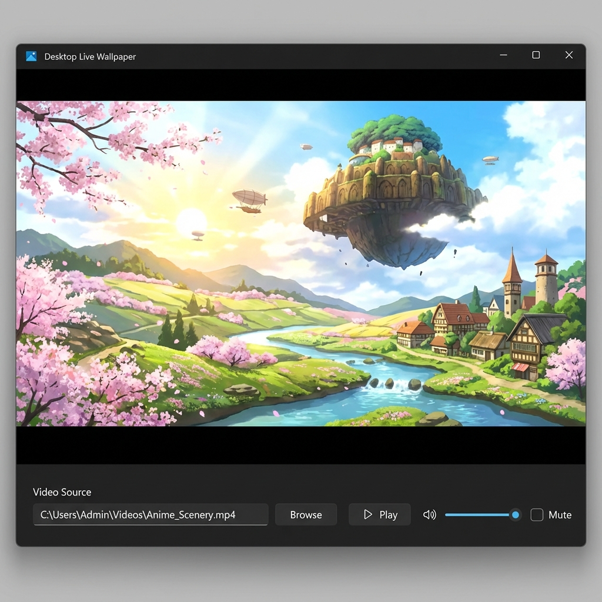

# Desktop Live Wallpaper (Floating Player)

A lightweight, floating video player designed for multitasking. Play any YouTube video or local file in a persistent, borderless-style window that you can resize and verify anywhere on your desktop.

## Features

- **Floating Window Mode**: Launch a sleek, borderless player that stays out of your way but remains accessible.
- **Auto-Hide Controls**: Mouse over the window to reveal controls; mouse away for a clean, distraction-free view.
- **Drag & Drop**: Click and drag anywhere on the video surface to move the window.
- **Robust YouTube Support**: Powered by **yt-dlp**, ensuring playback even for age-restricted or copyright-protected videos that standard players block.
- **Local File Support**: Drag and drop or browse for MP4, MKV, and MOV files.
- **Persistent Settings**: Remembers your volume, mute status, and last played video between sessions.
- **Error Console**: detailed logs help you troubleshoot playback issues instantly.

## Installation

1. Download the latest release from the [Releases Page](../../releases).
2. Extract the ZIP file.
3. Run `DesktopLiveWallpaper.exe`.

## Usage

1. **Launch the App**: It opens as a standard window.
2. **Play a Video**:
   - **YouTube**: Paste the full URL into the bottom text box and click **Play**.
   - **Local File**: Click **Browse** to select a video from your computer.
3. **Control**:
   - Volume slider and Mute toggle are at the bottom right.
   - Resize the window by dragging edges.
   - Move it by dragging the top title bar.

## Technology Stack

- **WinUI 3**: Modern, high-performance Windows UI.
- **yt-dlp**: Industry-standard command-line media downloader for reliable stream resolution.
- **.NET 8**: Built on the latest .NET runtime for speed and stability.

## Build from Source

1. Clone the repository.
2. Open `DesktopLiveWallpaper.sln` in Visual Studio 2022.
3. Build for `x64`.

## License

This project is licensed under the Apache License 2.0 - see the [LICENSE](LICENSE) file for details.
