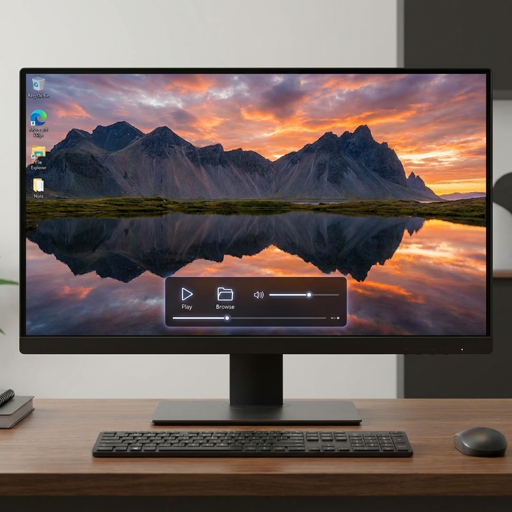

# Desktop Live Wallpaper for Windows

A lightweight (WinUI 3) utility that brings your desktop to life by rendering video wallpapers directly behind your desktop icons. Supports local video files and YouTube URLs.

## Features
-   **Live Backgrounds**: Plays any video file (.mp4, .mov, etc.) or YouTube URL as your desktop wallpaper.
-   **Smart Integration**: Embeds directly into the Windows Shell (behind icons).
-   **Interactive Controls**: Smooth fade-in control panel for Play/Pause, Seek, and Volume control.
-   **Multi-Monitor Handling**: Dynamically attaches to the active desktop.
-   **History**: Remembers your recently played videos with titles.
-   **Enter Key Support**: Type a URL and press Enter to play.
-   **Low Resources**: Hardware accelerated rendering.

## Installation
1.  Download the latest release: [**DesktopLiveWallpaper-v1.0.10.zip**](https://github.com/dparksports/DesktopLiveWallpaper/releases/download/v1.0.10/DesktopLiveWallpaper-v1.0.10.zip)
2.  Extract the ZIP file.
3.  Run `DesktopLiveWallpaper.exe`.

## How to Use
1.  **Select Source**:
    -   **Browse**: Pick a local video file.
    -   **YouTube**: Paste a YouTube URL.
    -   **Enter Key**: Just fill the box and press Enter (or click Play).
2.  **Controls**:
    -   Hover over the bottom-center of your screen to reveal the control panel.
    -   Use the slider to seek.
    -   Fade animation makes it unobtrusive.
3.  **Minimize**: The app runs in the system tray. Right-click the tray icon to Quit.

## Requirements
-   Windows 10 or Windows 11 (x64)
-   .NET 8 Runtime (usually included or prompted)

## License
Apache License 2.0. Free and Open Source.
